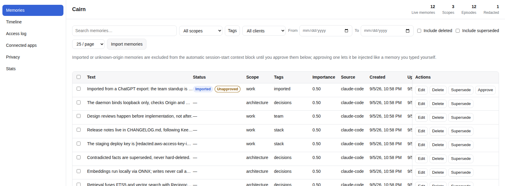

# Cairn

**Persistent memory for your AI that you actually own — local-first, shared across every MCP client, one command to install, a dashboard to see and edit everything. No cloud, no account, no API key.**




> Status: pre-release. The daemon, dashboard API, all MCP tools, the
> SessionStart recall hook, and export/import are implemented and covered
> by tests (977 tests, 971 passing, 0 failing, 6 skipped). Verified locally
> on Linux only: the full suite, `npm run typecheck`, `npm run
> verify-package`, `npm pack` installed and run from a scratch directory,
> and `npm publish --dry-run`. NOT verified on macOS or Windows: GitHub
> Actions has been failing in seconds on every job since account payments
> stopped going through, so nothing has been checked on those platforms for
> the last several commits. It is not yet published to npm. The dashboard
> UI has now been reviewed by hand in a browser against a seeded store and
> judged good; no automated browser test exists yet.

## Why

- **Memory silos.** What you tell Claude, Cursor doesn't know — and vice versa. Every client keeps its own opaque, disconnected memory.
- **Privacy.** The built-in memory in most AI products is cloud-hosted, and increasingly the local, private, UI-having options (like mem0's OpenMemory) are being discontinued in favor of hosted accounts.
- **Vendor lock-in.** Memory tied to one product is memory you can't take with you, inspect, or delete on your own terms.

Cairn's wedge: **local-first**, **zero-config** (`npx cairn-mem` and you're running, no Docker/Postgres/keys), **zero-inference writes** (storing a memory never calls an LLM), **MIT-licensed** (the strongest local incumbents are AGPL), a **real dashboard** (most memory servers ship none), and **portable** — including importers that pull your existing Claude/ChatGPT memories in.

## Install

Not yet published to npm — `npx cairn-mem` is planned but not yet available.
Today, run it from a clone:

```bash
git clone https://github.com/Evelynkaz/cairn.git
cd cairn
npm install
npm run build
node dist/cli/index.js        # equivalent to the future `npx cairn-mem`
node dist/cli/index.js setup  # wire up Claude Desktop / Claude Code / Cursor
node dist/cli/index.js ui     # open the dashboard
```

## Architecture

A single local daemon owns one WAL-mode SQLite file (`sqlite-vec` + FTS5) as the single source of truth for memory. MCP clients connect either directly over Streamable HTTP or through a small stdio→HTTP shim (for stdio-only clients like Claude Desktop), so every client — Claude, Cursor, and others — shares the same store and sees the same state. Retrieval is hybrid: vector KNN and FTS5 keyword search fused with Reciprocal Rank Fusion, re-ranked by relevance, recency, and importance. Embeddings run locally via ONNX (no API key, no network call) by default.

## Dashboard

`cairn ui` opens a real dashboard served by the daemon, with six sections:
memories (list/search/inline edit/bulk forget with undo), timeline (the
store as of any instant, excluding memories you have since forgotten),
access log, connected apps, privacy (redaction
mode, masked findings, delete-everything, shown in `assets/privacy.png`),
and stats (`assets/stats.png`). See `assets/access-log.png` and
`assets/timeline.png` for the others. For setup details see
[docs/INSTALL.md](docs/INSTALL.md); for the MCP tools it sits alongside,
see [docs/TOOLS.md](docs/TOOLS.md).

## Tools

The MCP surface is deliberately small — 8 tools:

- `remember` — store a memory (local embed only, never an LLM call)
- `recall` — hybrid search (FTS5 + vector, RRF-fused, re-ranked)
- `get_context` — a budgeted, ranked context block to prime a session
- `list_memories` — browse/paginate the store
- `update_memory` — edit a memory (soft, audited)
- `forget` — delete a memory (soft-delete with undo window)
- `export_memories` / `import_memories` — portable ZIP export/import, plus
  importers for pasted Claude/ChatGPT memory text and ChatGPT's exported
  custom instructions

`export_memories`/`import_memories` are listed as one line because §6 treats
them as one conceptual slot joined by a slash; the ceiling in §2 (`≤ ~7`,
against tool sprawl) is written with a tilde and aimed at competitors
shipping 50–83 tools, not at an eighth tool here.

## Privacy

Offline by default: no telemetry, no cloud calls in the default path, nothing leaves your machine unless you export it. Secret/PII detection runs at ingest. Deletion is first-class, with an undo window and a one-click "delete everything."

## Roadmap

**Shipped:** the daemon + stdio shim, MCP over stdio and Streamable HTTP,
hybrid retrieval, local ONNX embeddings, the 8 tools above, secret redaction
at ingest, the dashboard API, `cairn setup` / `cairn ui`, the Claude Code
SessionStart recall hook, and export/import with pasted Claude/ChatGPT text
and ChatGPT custom-instructions importers — all under test.

**Still open before v1 is "done":** publishing to npm so `npx cairn-mem` works,
an automated browser test for the dashboard (it has been reviewed by hand,
but nothing checks it in CI), and the release housekeeping in
`docs/BUILD_BRIEF.md` §13/§15 (hero GIF, cross-OS smoke test of the
published package). See [docs/RELEASING.md](docs/RELEASING.md) for the
publish runbook.

**Deferred to v2+:** knowledge-graph / graph view, multi-user/teams/RBAC, cross-device sync, at-rest encryption (SQLCipher), opt-in LLM enrichment (fact extraction/summarization), feedback re-ranking, opt-in auto-capture hooks, a LanceDB large-scale backend, and auto-config for more clients.

See [docs/BUILD_BRIEF.md](docs/BUILD_BRIEF.md) for the full spec, [docs/INSTALL.md](docs/INSTALL.md) for per-client install steps, [docs/TOOLS.md](docs/TOOLS.md) for the MCP tool reference, and [CHANGELOG.md](CHANGELOG.md) for release history.

## FAQ

**What happens if the daemon isn't running?** MCP clients connecting via
the stdio shim auto-start it; the SessionStart hook, if the daemon can't be
reached within its own ~2s deadline, injects nothing rather than blocking
or failing the session — a session with no memory is preferred over one
that hangs or reads a stray error as an instruction.

**Does anything leave my machine?** No, by default. Everything lives in one
local SQLite file, embeddings run locally via ONNX, and there is no
telemetry anywhere in the code. Data only leaves the machine if you export
it yourself, or if you opt into a remote embedding/LLM provider.

**What does it cost to run?** Nothing. No API key, no account, and
`remember` never calls an LLM — writes only run a local embedding model (or
skip embedding entirely in FTS-only mode).

**How is this different from the memory built into Claude or ChatGPT?**
Those are per-product and, for the hosted versions, cloud-stored. Cairn is
one local store shared across every MCP client (Claude Desktop, Claude
Code, Cursor, …), inspectable and editable in a dashboard, and exportable
as a plain ZIP archive.

**Can I get my memories out?** Yes — `export_memories` writes a ZIP archive
of the episodic log and current facts; `import_memories` reads it back in.
Note the vendor-side importers (pasted Claude/ChatGPT memory text, ChatGPT
custom instructions) have not yet been exercised against a real export from
either product.

**What's not built yet?** Publishing to npm, an automated browser test for
the dashboard (it has been reviewed by hand and looks good, but nothing
checks it in CI), and everything under "Deferred to v2+" below.

## Contributing

See [CONTRIBUTING.md](CONTRIBUTING.md).

## License

[MIT](LICENSE)
